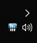
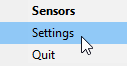
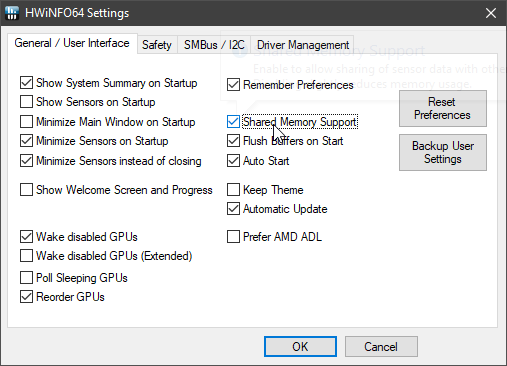

# HWiNFO Stream Deck Plugin

> Before installing the Stream Deck Plugin, you will need to enable "Shared Memory Support" within HWiNFO64.

## Enabling Support in HWiNFO64

1. Locate HWiNFO64 in your system tray

    

2.  Right click and choose Settings

    

3.  Locate and check "Shared Memory Support"

    

4. Click OK

## Install and Setup the Plugin
1. Download the pre-compiled plugin: [com.exension.hwinfo.streamDeckPlugin](../../raw/master/com.exension.hwinfo.streamDeckPlugin)

2. Double-click to install the plugin

3. Choose "Install" went prompted by Stream Deck

    

4. Locate "HWiNFO" under "Custom" in the action list

    

5. Drag the "HWiNFO" action from the list to a tile in the canvas area

    

6. Configure the action to display the sensor reading you wish

    