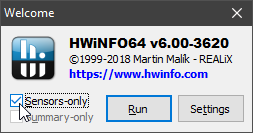
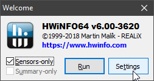
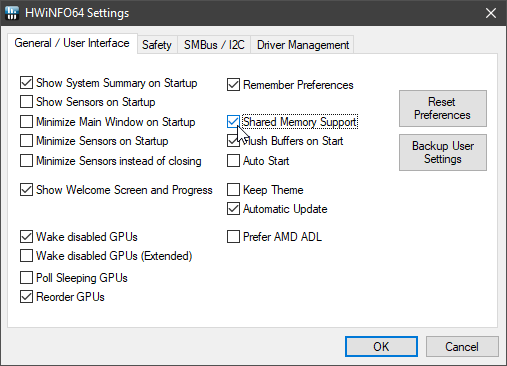
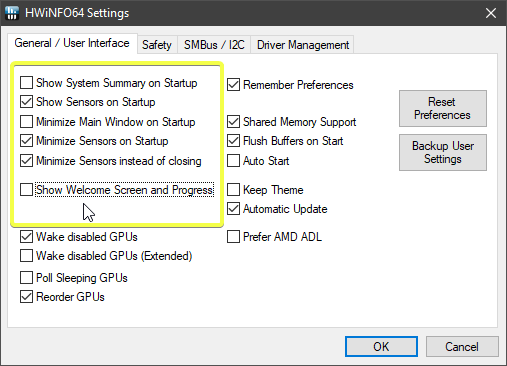
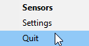

# HWiNFO Stream Deck Plugin

## ⚠⚠ Major refactor landed in pre-release v2.0.0, plugin code open sourced, remote monitoring infrastructure support ⚠⚠ 

---

>## Thank you & Looking for Maintainers
>
>Thank you everyone who has used and enjoyed this plugin. It started as a passion project and I continue to use it day to day. I am happy to finally release the full source on GitHub. When I first built it, it was closed under agreement with the HWiNFO64 project. They have since opened up the shared memory interface and now the plugin is freely open.
>
>I haven't had the time to dedicate to this project in some time and appreciate everyone for hanging in there. I hope to work with some of you who are eager to take the project over. I am happy and ready to hand over the reigns. If there are development questions I'm happy to share my thoughts on the code and structure that exists.
>
>*-Shayne*

---

> NOTICE: HWiNFO64 must be run in Sensors-only mode for the plugin to work. 

## Enabling Support in HWiNFO64

> NOTICE: It has been reported that running the "portable" version of HWiNFO64 doesn't work with this plugin. The recommendation is to run the version with the installer until I can figure out the issue.

1. Download and install HWiNFO64, if you haven't already

    [HWiNFO Websote](https://www.hwinfo.com)

2. Choose "Sensors-only" mode

    

3. Click "Settings"

    

4. Ensure "Shared Memory Support" is checked

    

5. (Optional) Recommended launch settings

    

6. Click "OK" then, "Run"

    > If the plugin doesn't work immediately, you may have to quit and reopen HWiNFO64.
    >
    > From the system tray:
    >
    > 

## Install and Setup the Plugin

1. Download the latest pre-compiled plugin

    [Plugin Releases](../../releases)

    > When upgrading, first uninstall: within the Stream Deck app choose "More Actions..." (bottom-right), locate "HWiNFO" and choose "Uninstall". Your tiles and settings will be preserved.

2. Double-click to install the plugin

3. Choose "Install" went prompted by Stream Deck

    

4. Locate "HWiNFO" under "Custom" in the action list

    

5. Drag the "HWiNFO" action from the list to a tile in the canvas area

    

6. Configure the action to display the sensor reading you wish

    
